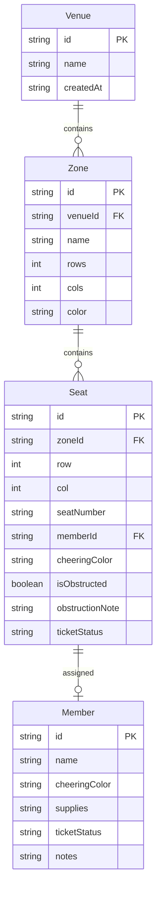

## 1. 架构设计

```mermaid
graph TB
    subgraph "前端层"
        "React 18" --> "Zustand 状态管理"
        "Zustand 状态管理" --> "localStorage 持久化"
        "React 18" --> "TailwindCSS 样式"
        "React 18" --> "React Router 路由"
    end
    subgraph "数据层"
        "localStorage" --> "场馆区域数据"
        "localStorage" --> "座位数据"
        "localStorage" --> "成员与物资数据"
    end
```

## 2. 技术说明
- 前端：React@18 + TailwindCSS@3 + Vite
- 初始化工具：vite-init
- 后端：无（纯前端，数据存储在 localStorage）
- 数据库：无（localStorage 代替）
- 状态管理：Zustand（含 persist 中间件自动同步 localStorage）

## 3. 路由定义
| 路由 | 用途 |
|------|------|
| / | 总览页，显示区域看板和统计面板 |
| /zone/:zoneId | 座位规划页，显示指定区域的座位网格和编辑面板 |

## 4. API定义
无后端API，所有数据通过 Zustand store 管理，使用 persist 中间件自动持久化到 localStorage。

## 5. 服务端架构图
不适用（纯前端项目）

## 6. 数据模型

### 6.1 数据模型定义



### 6.2 数据定义语言

TypeScript 接口定义：

```typescript
interface Venue {
  id: string;
  name: string;
  createdAt: string;
}

interface Zone {
  id: string;
  venueId: string;
  name: string;
  rows: number;
  cols: number;
  color: string;
}

interface Seat {
  id: string;
  zoneId: string;
  row: number;
  col: number;
  seatNumber: string;
  memberId: string | null;
  cheeringColor: string;
  isObstructed: boolean;
  obstructionNote: string;
  ticketStatus: 'none' | 'confirmed' | 'pending' | 'exchanged';
}

interface Member {
  id: string;
  name: string;
  cheeringColor: string;
  supplies: string;
  ticketStatus: 'none' | 'confirmed' | 'pending' | 'exchanged';
  notes: string;
}
```
